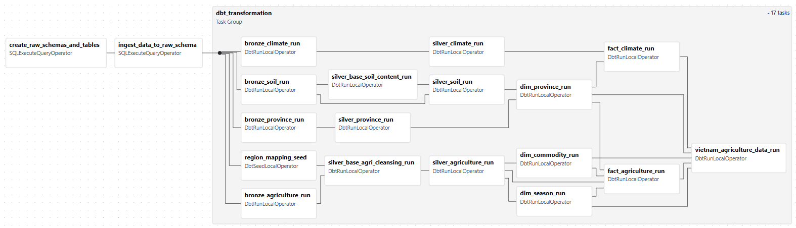
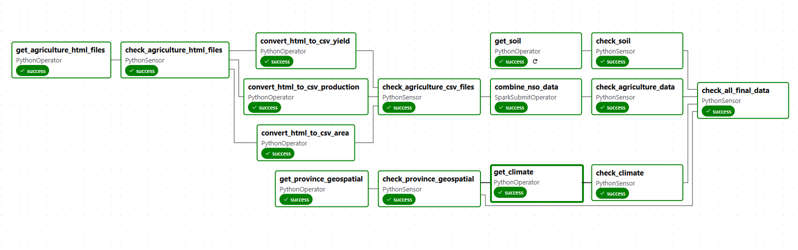

# Vietnam Agriculture Data Warehouse




## 📖 Introduction
The **Vietnam Agriculture Data Warehouse** is a comprehensive data engineering project designed to ingest, transform, and analyze agricultural, climatic, and soil data from Vietnam. 

Built on the **Medallion Architecture**, it transforms raw CSV data into high-quality analytical assets using **Apache Airflow** for orchestration, **PostgreSQL** for storage, and **dbt** for transformation.

## 🚀 Key Features
- **Automated Pipeline**: End-to-end ELT pipeline managed by Airflow.
- **Data Quality**: Rigorous testing and transformation using dbt.
- **Analytics Ready**: Star schema design optimized for BI tools (PowerBI, Tableau).
- **ML Ready**: Feature-rich wide tables prepared for data science use cases.
- **Containerized**: Fully Dockerized environment for easy deployment.

## 🛠️ Tech Stack
- **Orchestration**: Apache Airflow 2.x
- **Transformation**: dbt (Data Build Tool) Core 1.7
- **Database**: PostgreSQL 13
- **Infrastructure**: Docker & Docker Compose
- **Language**: Python 3.8+, SQL

## 📂 Documentation Map

| Document | Description |
|----------|-------------|
| [**ARCHITECTURE.md**](docs/ARCHITECTURE.md) | High-level system design and component interaction. |
| [**PIPELINE.md**](docs/PIPELINE.md) | Detailed breakdown of the Airflow DAGs and data flow. |
| [**DEPLOYMENT.md**](docs/DEPLOYMENT.md) | Step-by-step guide to set up and run the project locally. |
| [**DATA_DICTIONARY.md**](docs/DATA_DICTIONARY.md) | Detailed schema information for Bronze, Silver, and Gold layers. |
| [**dbt/README.md**](dbt/README.md) | Specific documentation for the dbt project structure. |

## ⚡ Quick Start

1.  **Clone the repo**:
    ```bash
    git clone <repo_url>
    ```
2.  **Start the stack**:
    ```bash
    docker compose up --build -d
    ```
3.  **Access Airflow**:
    Go to [http://localhost:8080](http://localhost:8080) (User/Pass: `airflow`/`airflow`) and trigger the `vietnam_agri_data_warehouse` DAG.

👉 *For detailed setup instructions, please refer to [DEPLOYMENT.md](docs/DEPLOYMENT.md).*

## 📄 License
This project is licensed under the [Mozilla Public License Version 2.0](LICENSE).
