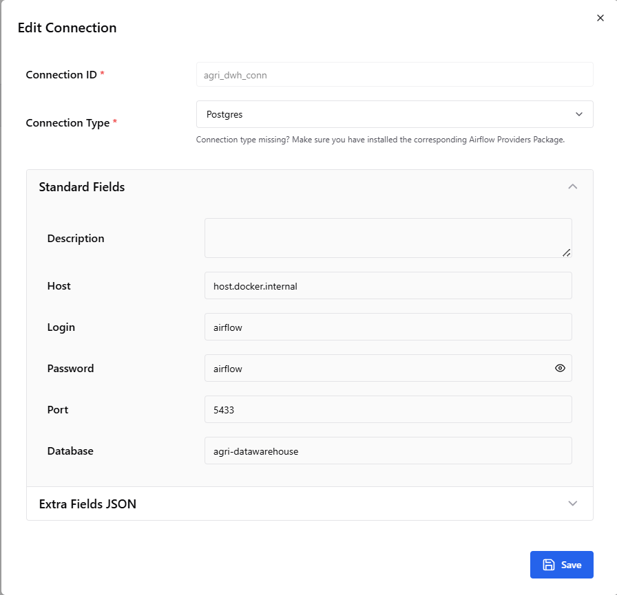

# Deployment & Setup Guide

## 📋 Prerequisites

Ensure you have the following installed on your machine:
- **Docker Desktop**: For running containers.
- **Git**: For cloning the repository.

## 🚀 Quick Start

### 1. Clone the Repository
```bash
git clone <repository-url>
cd vietnam-agriculture-data-warehouse-public
```

### 2. Environment Configuration
The project uses default credentials for development.
- **Airflow User/Pass**: `airflow` / `airflow`
- **Postgres User/Pass**: `airflow` / `airflow`
- **Database Name**: `agri-datawarehouse`
- Create a `.env` file in the repo root (optional, but required if the default setup fails):
```
AIRFLOW_UID=50000
```

### 3. Prepare Data
Since raw data is not committed to the repository (to avoid large files), you can use the provided sample data for testing.

**Option A: Use Sample Data (Recommended for Demo)**
Run the helper script to populate `data/raw` with sample files:
```bash
# Linux/Mac
python3 scripts/load_sample_data.py

# Windows
python scripts/load_sample_data.py
```

**Option B: Use Full Data**
If you have the full dataset, place the CSV files (`agriculture.csv`, `climate.csv`, `province.csv`, `soil.csv`) directly into the `data/raw/` folder.

### 4. Config Postgres Connection in Airflow UI
To allow Airflow to communicate with the PostgreSQL database, you need to configure the connection:

1.  Access the Airflow UI at [http://localhost:8080](http://localhost:8080).
2.  Navigate to **Admin** > **Connections**.
3.  Click the **+** (Add a new record) button.
4.  Fill in the form with the following details:
    *   **Connection Id**: `agri_dwh_conn`
    *   **Connection Type**: `Postgres`
    *   **Host**: `postgres`
    *   **Schema**: `agri-datawarehouse`
    *   **Login**: `airflow`
    *   **Password**: `airflow`
    *   **Port**: `5432`
5.  Click **Save**.




### 5. Start Services
Run the following command to build and start the entire stack:

```bash
docker compose up --build -d
```

This will start:
- Postgres Database
- Airflow Webserver, Scheduler, Triggerer
- dbt Development Container

### 6. Verify Installation
Check if all containers are running:
```bash
docker compose ps
```

## 🖥️ Accessing Interfaces

| Service | URL | Credentials | Description |
|---------|-----|-------------|-------------|
| **Airflow UI** | [http://localhost:8080](http://localhost:8080) | `airflow`/`airflow` | Monitor DAGs and pipelines. |
| **dbt Docs** | [http://localhost:8580](http://localhost:8580) | N/A | View data lineage and documentation (requires generation). |
| **Postgres** | `localhost:5433` | `airflow`/`airflow` | Direct database access (mapped port). |

## 🛠️ Common Operations

### Triggering the Pipeline
1. Go to Airflow UI.
2. Enable the DAG `vietnam_agri_data_warehouse`.
3. Click the "Trigger DAG" (Play) button.

### Generating dbt Documentation
To view the dbt documentation, you need to generate it inside the container:

```bash
# Enter the dbt container
docker exec -it dbt_dev /bin/bash

# Generate docs
dbt docs generate

# Serve docs (runs on port 8080 inside container, mapped to 8580 on host)
dbt docs serve
```
This will be available at [http://localhost:8580](http://localhost:8580).

### Stopping Services
To stop all containers:
```bash
docker compose down
```
To stop and remove volumes (reset data):
```bash
docker compose down -v
```
