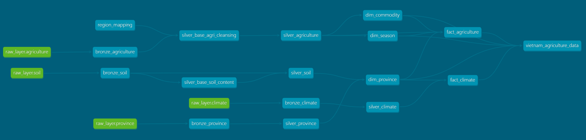
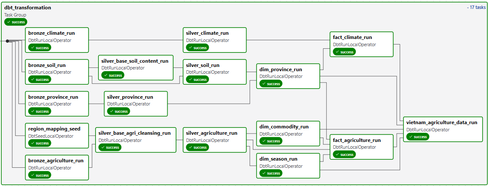

# Data Pipeline

## 🔄 Pipeline Overview

The primary pipeline is defined in the Airflow DAG `vietnam_agri_data_warehouse`. It runs daily and orchestrates the flow from raw data ingestion to the final analytical tables.

## 🛠️ DAG: `vietnam_agri_data_warehouse`

### Schedule
- **Interval**: `@daily` (Runs once a day).
- **Start Date**: 2025-01-01.

### Workflow Steps

#### 1. Initialization & Ingestion
- **Task**: `create_raw_schemas_and_tables`
  - **Type**: `SQLExecuteQueryOperator`
  - **Description**: Executes DDL scripts (`sql/raw/ddl_raw.sql`) to ensure the `raw_layer` schema and tables exist in PostgreSQL.
- **Task**: `ingest_data_to_raw_schema`
  - **Type**: `SQLExecuteQueryOperator`
  - **Description**: Executes DML scripts (`sql/raw/dml_raw.sql`) to load data from source files (CSV) into the raw tables.

#### 2. Transformation (dbt)

- **Task Group**: `dbt_transformation`
  - **Type**: `DbtTaskGroup` (via Cosmos)
  - **Description**: Automatically parses the dbt project and creates Airflow tasks for each model.
  - **Flow**:
    1.  **Bronze Models**: `bronze_agriculture`, `bronze_climate`, etc.
    2.  **Silver Models**: `silver_agriculture`, `silver_climate`, etc.
    3.  **Gold Models**: `fact_agriculture`, `dim_province`, etc.

For more details, see [dbt/README.md](../dbt/README.md).

## 📊 Data Lineage

The lineage is automatically managed by dbt.
- **Source**: Raw SQL Tables (`raw_layer`).
- **Downstream**: Bronze Views -> Silver Tables -> Gold Facts/Dims.

You can visualize the full lineage by running `dbt docs serve`.

For more details, see [dbt/README.md](../dbt/README.md) and [DEPLOYMENT.md](DEPLOYMENT.md)